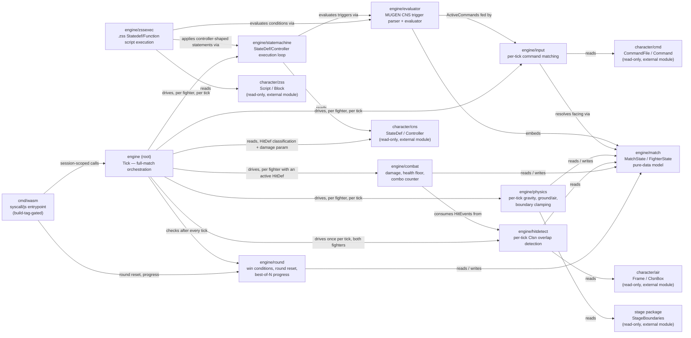
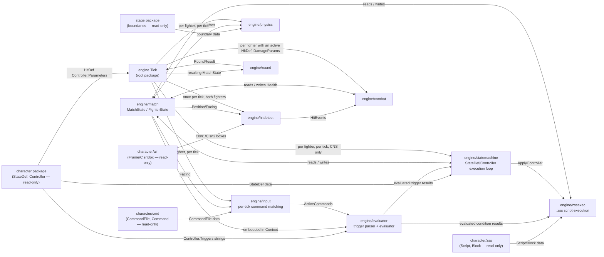

> Generated by /vibe:docs — manual edits will be overwritten; use README for hand-written content.

# Architecture

`engine` is organized as a thin root package assembling format-specific-equivalent sub-packages, added one per backlog item in dependency order. The backlog's own sequencing is now complete: ten sub-packages exist, and the root package itself has grown from a bare skeleton into the orchestration point (`Tick`) that ties every one of them into a usable match loop, exposed to a JS host via a WASM entrypoint (`cmd/wasm`).

## `engine` (root)

The module's entry point — still exposes `Version` (a `const string`), and now also the single function tying every sub-package into a usable match loop.

- **`Tick(state match.MatchState, programs [2]FighterProgram, runtimes [2]FighterRuntime, inputs [2]input.TickInput, cfg TickConfig) (TickResult, error)`** — advances one full simulation tick for both fighters: per fighter, `input.Step` then `statemachine.Step` (CNS execution only — `.zss` is deliberately not wired in here, see `.vibe/decisions/011`) and current-animation-frame resolution; then, once for the pair, `hitdetect.Detect`; then, per fighter whose state's `HitDef` controller triggered this tick, `combat.ApplyHits`; then, per fighter, `physics.Step`; then `round.CheckOutcome`. The two-fighter fan-out is explicitly unrolled (two named calls, not a loop or a closure) to hold the same zero-allocation discipline `hitdetect`/`combat` already established — measured at 4 allocs/tick on the no-hit/no-transition path, all attributable to `input.Step`'s own pre-existing per-side map allocations, none added by `Tick` itself.
- **`TickConfig`** — bundles `Tick`'s simulation-constant parameters (`Bounds *stage.StageBoundaries`, `Gravity float64`, `ComboWindow int`) together with the current `Tick int` tick number. Passed by value: at this size it is cheap to copy and stays off the heap, so a caller building a fresh `TickConfig{...}` literal every tick (as `cmd/wasm`'s `tickJS` does) adds no allocation on top of `Tick`'s existing 4-allocs/tick baseline above.
- **`FighterProgram`** — one fighter's read-only, loaded-once character data for the whole match: `States map[int]cns.StateDef`, `Animations []air.Animation`, `Commands cmd.CommandFile`.
- **`FighterRuntime`** — one fighter's evolving per-tick state, threaded by the caller the same way every sub-package's own carried state already is: `Context evaluator.Context`, `Input input.State`, `Combo combat.ComboState`.
- **`NewFighterRuntime(fighter match.FighterState, states map[int]cns.StateDef) (FighterRuntime, error)`** — builds a fresh `FighterRuntime` for a fighter entering `states[fighter.StateNo]` for the first time (match start, or after `round.ResetRound`): `Time`/`AnimTime` start at 0, `Anim`/`Ctrl` take the entered state's own declared values.
- **Frame timing lags a same-tick transition by one tick** — `Tick` resolves each fighter's currently-displayed frame *before* applying that tick's own state transition; the new state's animation (and any `HitDef` inside it) only becomes active starting the *next* tick, once `AnimTime`/`Time` have actually reset to 0. This is why a scripted attack takes two ticks to land: one tick to transition into the attack state, one more for that state's own `HitDef` to actually be evaluated. See `.vibe/decisions/011`.

## `engine/match`

Defines the pure-data model for the live state of a match while two characters fight:

- `Position` / `Velocity` — 2D stage-coordinate value types
- `Side` (`SideP1`, `SideP2`) and `Facing` (`FacingRight`, `FacingLeft`) — small enums
- `FighterState` — one fighter's position, facing, velocity, current state number (`StateNo`, matching a loaded character's `cns.StateDef.Number`), and health
- `MatchState` — the round number, round timer, and both fighters' `FighterState`, indexed by `Side`
- `NewMatchState(round, roundTimer int, fighters ...FighterState) (*MatchState, error)` — the only way to build a fully validated `MatchState`; it requires exactly one `FighterState` per `Side` and returns a descriptive error otherwise

This package carries no evaluation, execution, or simulation logic — every other `engine` package (trigger evaluator, state machine, physics, hit detection, damage/combo, round flow) is expected to read from and write to `match.MatchState`/`match.FighterState` as its shared data source, per the dependency order in the backlog.

## `engine/evaluator`

Parses and evaluates MUGEN CNS trigger/expression strings — the raw `Controller.Triggers`/`Controller.Parameters` strings that `character/cns` deliberately leaves unevaluated (see that package's decision 011).

- **Lexer** (`lex`) — tokenizes an expression string: numbers, double-quoted strings, identifiers (trigger/function names, allowing dotted names like `Vel.X` for forward compatibility), parentheses, commas, and operators (multi-character operators such as `!=`, `<=`, `>=`, `&&`, `||` are matched before their single-character prefixes).
- **Parser** (`Parse`) — a recursive-descent parser building an AST (`node` and its variants in `ast.go`), honoring MUGEN's operator precedence from lowest to highest: `||`, `&&`, comparisons (`=`, `!=`, `<`, `>`, `<=`, `>=`), additive (`+`, `-`), multiplicative (`*`, `/`, `%`), then unary (`!`, `-`). Returns a descriptive error — never a panic — for empty, unbalanced, or otherwise malformed input.
- **Context** — the per-fighter, per-tick data an expression is evaluated against. It embeds `match.FighterState` (for `StateNo` and friends) and adds runtime fields that item 001 doesn't model yet: `Time`, `Ctrl`, `Anim`, `AnimTime`, `Vars`/`SysVars` (MUGEN's general-purpose/system variable slots), and `ActiveCommands` (the input-command redirect used by the `Command` trigger). See `.vibe/decisions/002` for why this is a separate type rather than an extension of `FighterState`.
- **Eval** (`Expression.Eval`, and the `Evaluate` convenience that parses and evaluates in one call) — walks the AST against a `Context`, returning a `Value` (`Kind`: `KindBool`/`KindInt`/`KindFloat`, plus a `Number` float64) that follows MUGEN's loose typing (e.g. `true` and `1` compare equal, `3` and `3.0` compare equal). Built-in triggers currently supported: `Time`, `StateNo`, `Anim`, `AnimTime`, `Ctrl`, `Command` (only in the `Command = "name"` / `Command != "name"` form), `var(n)`, `sysvar(n)`, and `IfElse(cond, a, b)`. An unknown trigger/function name, a wrong argument count, an out-of-range `var`/`sysvar` index, or a bare string literal used outside a `Command` comparison all return a descriptive error rather than a panic or a silently wrong value. The built-in set is meant to grow incrementally as later items (state machine execution, hit detection, ...) need more of MUGEN's trigger vocabulary — it does not aim to be exhaustive yet.
- **`Evaluate` memoizes `Parse` in a package-level `parseCache`** — a controller's trigger/parameter string, loaded once and checked every simulation tick for the whole match, is only lexed/parsed the first time it's seen, not on every call. Safe unsynchronized: this engine targets a single-threaded `GOOS=js GOARCH=wasm` build with no goroutines in the simulation loop.

## `engine/statemachine`

Drives a fighter's state transitions by interpreting `character/cns`'s `StateDef`/`Controller` data (read-only; `engine` depends on the tagged `github.com/openkakutou/character` module, resolved through the standard Go module proxy) with `engine/evaluator`.

- **`Step(ctx evaluator.Context, states map[int]cns.StateDef) (Result, error)`** — the whole package's entry point. Looks up `ctx.StateNo` in `states`, then evaluates that `StateDef`'s controllers in declared order: a controller's trigger strings are combined with logical AND (see `.vibe/decisions/003` — `character/cns`'s `Controller.Triggers` does not retain which `triggerN` group each string came from, so MUGEN's full group-based OR/AND semantics cannot be reconstructed), and every controller whose combined trigger evaluates true is applied, mutating a working `Context` so a later controller in the same call can observe an earlier one's effect.
- **Implemented controller types** — `ChangeState` (updates `StateNo` to the `value` parameter's evaluated target, validated against a state-existence check, and resets `Time` to 0 — see `.vibe/decisions/004` for why `Step` does not also auto-increment `Time` on every call) and `VarSet` (evaluates the `v` and `value` parameters and assigns `Context.Vars[v] = value`). Matching real MUGEN/Ikemen behavior, `Step` stops evaluating further controllers as soon as a `ChangeState` applies. A controller of any other type is recorded in `Result.Applied` when its trigger evaluates true, but has no effect — full MUGEN controller-type coverage is expected to grow via later items, not this one.
- **`Result`** — the updated `Context` plus `Applied`, the declared-order indices of every controller whose trigger evaluated true this call, regardless of whether its type is implemented.
- **`ApplyController(ctrl cns.Controller, ctx *evaluator.Context, exists func(int) bool) (bool, error)`** — the single-controller effect logic `Step` itself uses, exported so `engine/zssexec` can apply the exact same `ChangeState`/`VarSet` behavior to a `.zss` controller-shaped statement instead of re-implementing it. `exists` replaces `Step`'s own `states map[int]cns.StateDef` lookup with a plain predicate, since `zssexec` has no `cns.StateDef` map to check a `.zss` script's own state numbers against. See `.vibe/decisions/008`.

## `engine/zssexec`

Executes `character/zss`'s parsed Statedef/Function script bodies — the `.zss` counterpart to `engine/statemachine` for Ikemen GO's alternative to classic `.cns` combat logic. `character/zss` only parses block headers; a block's script body is kept as raw, unevaluated text (that package's own decision 027) — running it is this package's job.

- **Why a hand-written interpreter, not an embedded Lua VM** — `.zss` is commonly described as "Lua-like", but its actual body grammar (`if COND { ... }` with C-style braces, a single `=` for comparison, controller-call statements shaped like `changeState{value: 5001;}`) is not valid standard Lua syntax; a real Lua VM would reject it as-is. See `.vibe/decisions/008` for the full reasoning.
- **`Step(ctx evaluator.Context, script zss.Script) (Result, error)`** — the package's entry point, mirroring `statemachine.Step`'s shape. Finds `script`'s `Statedef` block for `ctx.StateNo`, parses its body into statements, and runs them from the top against a working copy of `ctx`.
- **Supported statement forms** — `if COND { ... }` with an optional `else { ... }` (`COND` evaluated by `engine/evaluator.Evaluate` unchanged, since `.zss` conditions already use the same trigger-expression operators `.cns` triggers do); a single-line controller-call statement (`Name{key: value; ...}`, applied via `statemachine.ApplyController`); and `call FunctionName();`, which looks up a same-script `Function` block by name and runs its body the same way (only zero-parameter, no-return-value functions are supported so far).
- **Stop-on-state-change** — the same rule `statemachine.Step` follows: once a `ChangeState`-shaped statement applies, no further statement runs for that call, at any nesting level (inside an `if`, inside a called function, or after either returns to its caller).
- **Error handling** — a descriptive error, never a panic, for: `ctx.StateNo` missing from `script`; a `let` assignment or any other construct this package doesn't parse; a `call` to an undefined function, or one declaring parameters/a return value; and the same condition-evaluation/`ChangeState`-target errors `statemachine.ApplyController` already reports.
- **`maxCallDepth` (64) bounds `call FunctionName();` recursion** — `.zss` script bodies are untrusted, mod-authored content; direct or mutual recursion between functions fails with a descriptive error once nesting exceeds the limit, instead of crashing the process via unbounded Go-stack recursion.

## `engine/input`

Reads a fighter's raw per-tick input and matches it, within a buffered time window, against `character/cmd`'s `.cmd` command definitions — so a `Command = "name"` trigger (already implemented by `engine/evaluator`, reading `Context.ActiveCommands`) resolves correctly.

- **`TickInput`** — one tick's raw device input: `Up`/`Down`/`Left`/`Right` plus a `Buttons` set. Deliberately raw, not facing-relative — `.cmd` command strings are authored relative to facing (`F`/`B`), so `Step` resolves Left/Right against the fighter's current `match.Facing` internally rather than pushing that translation onto every input source. See `.vibe/decisions/005`.
- **`State`** — a command matcher's per-command progress, threaded across ticks by the caller exactly the way `evaluator.Context` is threaded through `statemachine.Step` calls; this package holds no hidden state of its own. Its zero value starts every command unmatched.
- **`Step(state State, tick int, facing match.Facing, in TickInput, cmds cmd.CommandFile) (State, map[string]bool)`** — advances every command in `cmds` by one simulation tick. A command is recognized once its full step sequence (parsed from `Command.Input`, e.g. `"~D, DF, F, a"`) matches in order within its recognition window (`Command.Time`, falling back to `CommandFile.Defaults.Time`), then stays reported active for its buffer window (`Command.BufferTime`/`Defaults.BufferTime`) afterward. A tick that breaks an in-progress sequence is retried against the command's first step on the same tick, so one wrong input doesn't force a full replay. The returned `map[string]bool` is directly assignable to `evaluator.Context.ActiveCommands`.
- **Command-string parsing** (internal: `step`, `directionSet`, `parseSteps`) — splits a command string on `,` into ordered steps, and each step on `+` into simultaneously-required directions/buttons. Direction tokens (`U`/`D`/`B`/`F`/`UB`/`UF`/`DB`/`DF`) are matched case-sensitively against the exact uppercase MUGEN convention, since a lowercase letter is a button name instead (e.g. `B` is "back", `b` is the kick button) — see the package's own case-sensitivity handling. Leading modifier characters (`~`, `$`, `/`, `>`) are recognized and stripped rather than semantically implemented; see `.vibe/decisions/006`.

## `engine/physics`

Advances a fighter's position and vertical velocity by one simulation tick, reading `stage.StageBoundaries` (read-only; `engine` depends on the tagged `github.com/openkakutou/stage` module the same way it depends on `character`) — the first `engine` package to actually consume `stage`'s output.

- **`Step(f match.FighterState, bounds *stage.StageBoundaries, gravity float64) (match.FighterState, error)`** — the package's entry point. Gravity decrements `Velocity.Y` only while the fighter is airborne, then `Velocity` integrates into `Position` for the tick; a fighter that ends the tick at or below the ground plane (`Position.Y <= 0`) is clamped to it with `Velocity.Y` zeroed (landing), and `Position.X` is clamped to `bounds` regardless of how far a single tick's velocity would otherwise have carried it past the edge.
- **Ground/air state is derived, not stored** — `Position.Y <= 0 && Velocity.Y <= 0` means grounded; there is no `Grounded` field on `match.FighterState`. A fighter given upward velocity while still at `Y == 0` (a jump's takeoff tick) is treated as airborne immediately, so gravity applies starting that same tick. See `.vibe/decisions/007`.
- **`bounds` is a pointer, not a value** — `nil` means "no stage boundary data supplied" and returns a descriptive error, distinguishing that case from a legitimately zero-width (but supplied) boundary; a boundary where `Left >= Right` is also rejected as unusable.
- **Gravity is a caller-supplied rate, not a package constant** — no single gravity value is canonical across MUGEN/Ikemen GO content, so `Step` takes it as an explicit parameter rather than baking in a game-balance number.

## `engine/hitdetect`

Resolves Clsn (collision box) overlap between two fighters each simulation tick, reading `character/air`'s already-resolved `Frame.Clsn1`/`Frame.Clsn2` boxes (read-only; `engine` already depends on `character` for `engine/statemachine`) together with `match.MatchState` — the first `engine` package to depend on `character/air` specifically. It works the same regardless of whether a fighter's current frame is being driven by `engine/statemachine` or `engine/zssexec`, since both ultimately produce the same animation/frame progression; this package takes each fighter's current `air.Frame` as a plain input rather than resolving it itself.

- **`Detect(state *match.MatchState, frames [2]air.Frame) []HitEvent`** — the package's entry point. Checks both attack directions (`SideP1`'s Clsn1 against `SideP2`'s Clsn2, and vice versa) and returns one `HitEvent` per overlapping box pair found. `frames` is indexed by `Side` the same way `state.Fighters` is. Does not apply damage itself — only detects and reports collisions, for a later item (damage/combo) to consume.
- **`HitEvent`** — `Attacker`/`Defender` (`match.Side`) plus `AttackerBox`/`DefenderBox`, the original local `air.ClsnBox` values as found on each fighter's current frame (not the world-space boxes actually compared), so a consumer can trace an event back to the source `.air` data.
- **Local-to-world coordinate transform** — a Clsn box's local coordinates increase *downward* (confirmed against a real `.air` fixture) while `match.Position.Y` increases *upward*; `Detect` flips the Y axis and mirrors the X axis for `FacingLeft` before comparing two fighters' boxes as plain axis-aligned bounding boxes. See `.vibe/decisions/009` for the full reasoning, including why a frame with no Clsn boxes at all needs no special-casing (the geometry loop simply has nothing to iterate).
- **Zero-allocation on a zero-hit tick** — this runs unconditionally every simulation tick for the whole match; the result slice starts `nil` and only grows via `append` on an actual overlap, never pre-sized, so the overwhelmingly common zero-hit tick allocates nothing (verified by an `AllocsPerRun` test and confirmed via `go build -gcflags="-m"` that the per-pair coordinate transform itself is inlined and never escapes to the heap). See `.vibe/decisions/009`.

## `engine/combat`

Applies `hitdetect`'s `HitEvent`s to actual match state: damage subtracted from the defender's health, and a per-defender combo counter tracked across ticks. Takes a MUGEN `HitDef`'s raw `"damage"` parameter as a small `DamageParams` value, extracted by the root package from `character/cns`'s `Controller` before calling in — the first place in the backlog that string gets interpreted numerically, done here rather than in `character/cns` itself since that package stays pure data. Does not drive any state-machine transition (e.g. a hit-reaction state); that's out of scope until a later item actually asks for it. See `.vibe/decisions/010`.

- **`ApplyHits(state match.MatchState, events []hitdetect.HitEvent, attacker match.Side, hitDef DamageParams, combo ComboState, tick, comboWindow int) (match.MatchState, ComboState, HitResult)`** — the package's entry point, called once per attacking side (the same "one direction per call" shape `hitdetect.Detect` checks internally for both directions at once). Dedupes multiple `events` against the same defender into a single landed hit — MUGEN registers one hit per attack regardless of how many Clsn boxes overlapped it — parses `hitDef.Damage` exactly once for that hit, floors the defender's resulting health at zero, and advances `combo`. Returns `state`/`combo` unchanged and a zero `HitResult` when no event in `events` matches `attacker`.
- **`DamageParams`** — just the `HitDef`'s raw `Damage` string, not the full `character/cns.Controller` a `HitDef` is parsed into. The caller (`tick.go`) extracts `Parameters["damage"]` before calling `ApplyHits`, keeping this package decoupled from a controller shape it never otherwise reads — unlike `statemachine.ApplyController`/`zssexec`'s own controller-call handling, which genuinely need the whole `cns.Controller` since they dispatch across multiple controller types.
- **`ComboState`** — `Count`/`LastHitTick`/`Active`, threaded by the caller across ticks the same way `input.State` is threaded through `input.Step`. A hit within `comboWindow` ticks of the previous one increments `Count`; a hit after the window lapsed starts a fresh `Count` of 1 instead. `ResetCombo()` returns a fresh, inactive state for a caller that determined (by its own means, e.g. a state-machine transition) that an in-progress combo has ended independent of the time window.
- **`DefaultDamage` (`0`)** — applied when `hitDef.Parameters["damage"]` is missing or not a valid integer, so a malformed `HitDef` still lands a (harmless) hit instead of crashing the simulation.
- **By-value `MatchState`, zero allocation** — `ApplyHits` takes and returns `match.MatchState` by value (mirroring `physics.Step`'s own shape) rather than a pointer, and the dedup scan is a plain early-return loop with no set/map — both verified allocation-free (`AllocsPerRun` tests for both the "no hit" and "hit lands" cases, `go build -gcflags="-m"` showing no escape) for the same single-threaded-WASM-GC reasons `hitdetect`'s own decision record already established. See `.vibe/decisions/010`.

## `engine/round`

Decides how a round ends, resets fighters for the next one, and tracks best-of-N match progress — the last piece `Tick` needed. Match-level bookkeeping (rounds won per side) is not carried on `match.MatchState` itself, following the same wrap-rather-than-reopen precedent `evaluator.Context` and `physics`'s derived "grounded" state already set; `Progress` is its own type here instead. See `.vibe/decisions/011`.

- **`CheckOutcome(state *match.MatchState) RoundResult`** — a KO when either or both fighters' health has reached zero (checked before a timeout, so a fighter that runs out of health and out of time on the same tick is still reported as a KO, matching real MUGEN/Ikemen precedence), or a timeout when `RoundTimer` has reached zero, broken by a health comparison (equal health is a draw). `RoundResult{Outcome: OutcomeNone}` (the zero value) means the round is still in progress.
- **`ResetRound(nextRound, roundTimer int, p1Start, p2Start match.FighterState) (*match.MatchState, error)`** — a thin, documented wrapper over `match.NewMatchState` for the "next round" case, surfacing that constructor's own validation as an error rather than a panic.
- **`Progress`** — `BestOf`, `Wins [2]int` (indexed by `match.Side`), `RoundsPlayed`. Built with `NewProgress(bestOf int) (Progress, error)`, which rejects a non-positive or even `bestOf` (a match can never end in a round-level tie). `RoundsToWin()` is `BestOf/2 + 1`. `RecordRoundResult(result RoundResult) Progress` advances `RoundsPlayed` and, for `OutcomeKO`/`OutcomeTimeout` only, the winning side's `Wins` — a drawn round (`OutcomeDoubleKO`/`OutcomeTimeoutDraw`) awards no round win to either side, matching real MUGEN/Ikemen behavior. `MatchOutcome() (decided bool, winner match.Side)` reports whether either side has reached `RoundsToWin`.

## `cmd/wasm`

The WASM entrypoint (`//go:build js && wasm`), following `character/cmd/wasm`'s own precedent: build-tag-gated, a single JS-callable global (`OpenKakutouEngine`), verified by a Node.js smoke harness (`smoke.mjs`) since `syscall/js` code cannot run under the plain Go toolchain.

- **Every exposed function takes/returns one JSON string**, in a uniform `{data, error}` envelope — exactly one field non-null, never throws (a panic is `recover()`-ed at the boundary, mirroring `character/cmd/wasm`'s own `load`/`resolveSprites`).
- **`newMatch(requestJSON)`** — builds round 1 of a match from both fighters' `FighterProgram` data and starting `match.FighterState`, plus stage bounds/gravity/comboWindow/bestOf; returns an opaque `matchId` plus each fighter's starting `animations` entry (see below).
- **`tick(requestJSON)`** — advances `matchId`'s session by one tick (calling `engine.Tick`, then recording any round outcome into the session's `round.Progress`); returns the resulting `match.MatchState`, `round.RoundResult`, `round.Progress`, whether/who has won the match outright, and each fighter's current `animations` entry.
- **`resetRound(requestJSON)`** — restores `matchId`'s session to a fresh next round via `round.ResetRound` plus a fresh `FighterRuntime` per side (`engine.NewFighterRuntime`); returns the reset `match.MatchState` plus each fighter's reset `animations` entry.
- **`animations` response field** — a `[2]FighterAnimState` (JSON `animNo`/`animTime`), indexed by `match.Side` like every other per-side array, present in `newMatch`/`tick`/`resetRound`'s responses. Sourced straight from the session's Go-resident `FighterRuntime.Context.Anim`/`.AnimTime` — additive, response-only data; `match.FighterState` (also the request-side `starting` shape) is untouched. Named `animNo` rather than `anim` to avoid reading as a duplicate of the sibling `stateNo` field — the two can diverge (`changeanim`). See `.vibe/decisions/012`.
- **`closeMatch(requestJSON)`** — deletes `matchId`'s entry from the session registry. Sessions are never pruned on their own, so a caller (a page ending a match, or leaving one mid-way) is expected to call this once a match ID is no longer needed, or its `FighterProgram`/`FighterRuntime` pairs stay resident in memory for the life of the WASM instance.
- **Per-match runtime state stays Go-side**, in a session registry keyed by `matchId`, rather than round-tripping `FighterRuntime`/`input.State`/`combat.ComboState` through JSON on every call — `input.State`'s own progress-tracking fields are unexported by design, so marshaling it from JS would silently lose in-flight command-recognition progress every call. Only already-JSON-tagged summary data (`match.MatchState`, `round.RoundResult`, `round.Progress`) ever crosses the JS boundary. See `.vibe/decisions/011`.

## Data flow

`character` and `stage` are read-only inputs `engine` never writes back to; `engine/match` is the mutable state every simulation-side package operates on, each tick. `engine/statemachine` is the first `engine` package to actually depend on `character` as a Go module, feeding it real `Controller.Triggers`/`Controller.Parameters` values from a parsed `.cns` file. `engine/zssexec` reads `character/zss`'s parsed `.zss` scripts the same way, but reuses `engine/statemachine`'s own `ApplyController` for the controller-call statements inside a script body rather than duplicating that logic. `engine/input` is the second `engine` package to depend on `character` as a Go module: it reads `character/cmd`'s `CommandFile` and feeds its recognized commands into `evaluator.Context.ActiveCommands`, the same map the `Command` trigger reads. `engine/physics` is the first `engine` package to depend on `stage` as a Go module, reading its `StageBoundaries` to clamp fighter movement. `engine/hitdetect` is the first `engine` package to depend on `character/air`, reading each fighter's already-resolved `Frame.Clsn1`/`Clsn2` boxes alongside `engine/match`'s `Position`/`Facing` to detect overlap — it does not itself resolve which frame is "current" from `Anim`/`AnimTime`, that remains the caller's responsibility. `engine/combat` closes the loop `hitdetect` opened: it reads `hitdetect`'s own `HitEvent`s plus a `DamageParams` (the root package's own extract of a `HitDef`'s raw `"damage"` parameter from `character/cns`'s `Controller` -- `combat` itself no longer depends on `character/cns` directly, see that item's own backlog entry) and writes the result back into `engine/match`'s `FighterState.Health` — the first `engine` package to actually mutate `match` state as a result of combat, rather than only reading it. `engine.Tick` (root package) is what actually drives all of the above, once per simulation tick, for both fighters (see `.vibe/decisions/011` for why `.zss`/`engine/zssexec` isn't wired into this loop); `engine/round` closes the final loop, deciding from `Tick`'s resulting `MatchState` whether the round just ended and, across calls, whether the whole match has been won.
