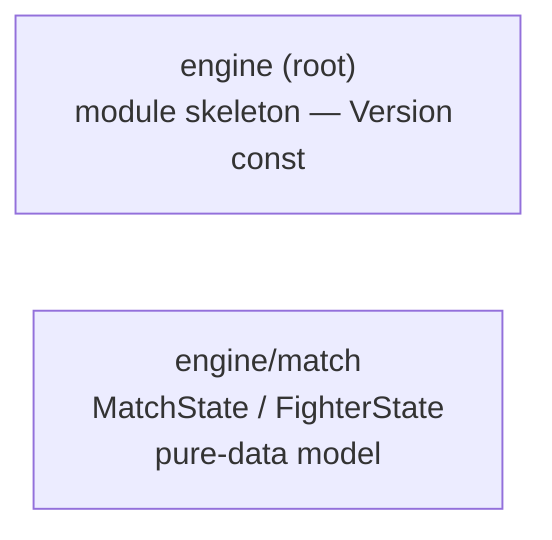
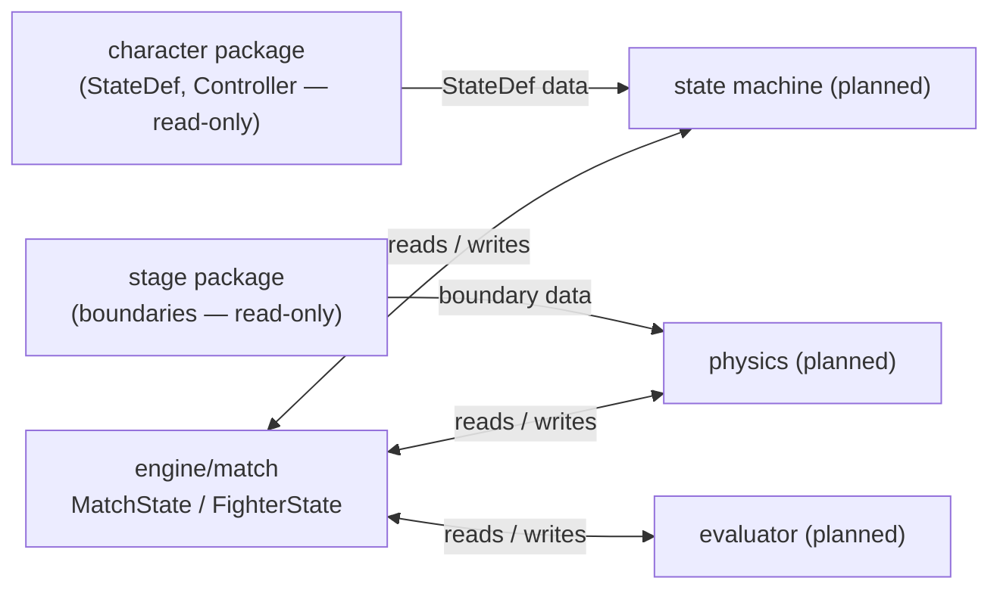

> Generated by /vibe:docs — manual edits will be overwritten; use README for hand-written content.

# Architecture

`engine` is organized as a thin root package assembling format-specific-equivalent sub-packages, added one per backlog item in dependency order. Only two exist so far:

## `engine` (root)

The module's entry point. Currently a skeleton exposing only `Version` (a `const string`). As later backlog items land (trigger evaluator, state machine, `.zss` execution, physics, hit detection, damage/combo, input, round/match flow), the root package is expected to stay a thin assembly point over the sub-packages, not accumulate logic itself.

## `engine/match`

Defines the pure-data model for the live state of a match while two characters fight:

- `Position` / `Velocity` — 2D stage-coordinate value types
- `Side` (`SideP1`, `SideP2`) and `Facing` (`FacingRight`, `FacingLeft`) — small enums
- `FighterState` — one fighter's position, facing, velocity, current state number (`StateNo`, matching a loaded character's `cns.StateDef.Number`), and health
- `MatchState` — the round number, round timer, and both fighters' `FighterState`, indexed by `Side`
- `NewMatchState(round, roundTimer int, fighters ...FighterState) (*MatchState, error)` — the only way to build a fully validated `MatchState`; it requires exactly one `FighterState` per `Side` and returns a descriptive error otherwise

This package carries no evaluation, execution, or simulation logic — every other `engine` package (trigger evaluator, state machine, physics, hit detection, damage/combo, round flow) is expected to read from and write to `match.MatchState`/`match.FighterState` as its shared data source, per the dependency order in the backlog.

## Data flow (expected, as later packages land)

`character` and `stage` are read-only inputs `engine` never writes back to; `engine/match` is the mutable state every simulation-side package operates on, each tick.
