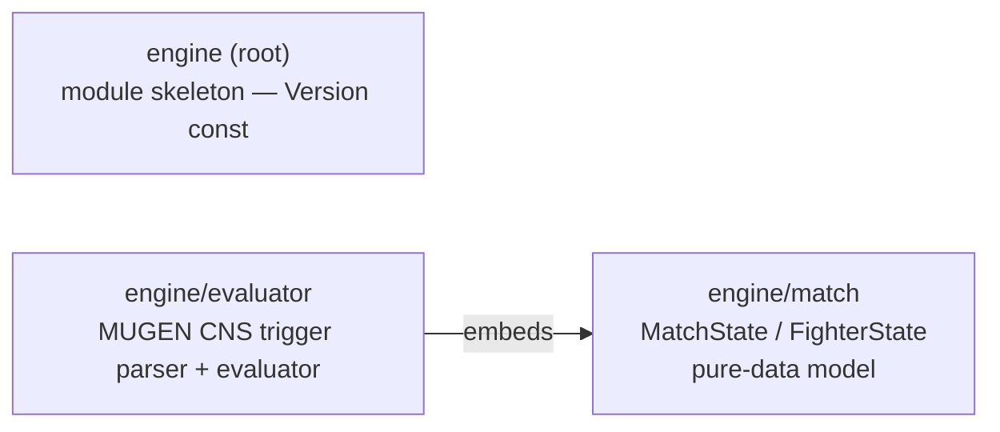
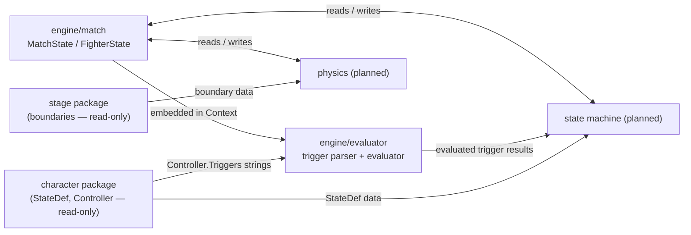

> Generated by /vibe:docs — manual edits will be overwritten; use README for hand-written content.

# Architecture

`engine` is organized as a thin root package assembling format-specific-equivalent sub-packages, added one per backlog item in dependency order. Three exist so far:

## `engine` (root)

The module's entry point. Currently a skeleton exposing only `Version` (a `const string`). As later backlog items land (state machine, `.zss` execution, physics, hit detection, damage/combo, input, round/match flow), the root package is expected to stay a thin assembly point over the sub-packages, not accumulate logic itself.

## `engine/match`

Defines the pure-data model for the live state of a match while two characters fight:

- `Position` / `Velocity` — 2D stage-coordinate value types
- `Side` (`SideP1`, `SideP2`) and `Facing` (`FacingRight`, `FacingLeft`) — small enums
- `FighterState` — one fighter's position, facing, velocity, current state number (`StateNo`, matching a loaded character's `cns.StateDef.Number`), and health
- `MatchState` — the round number, round timer, and both fighters' `FighterState`, indexed by `Side`
- `NewMatchState(round, roundTimer int, fighters ...FighterState) (*MatchState, error)` — the only way to build a fully validated `MatchState`; it requires exactly one `FighterState` per `Side` and returns a descriptive error otherwise

This package carries no evaluation, execution, or simulation logic — every other `engine` package (trigger evaluator, state machine, physics, hit detection, damage/combo, round flow) is expected to read from and write to `match.MatchState`/`match.FighterState` as its shared data source, per the dependency order in the backlog.

## `engine/evaluator`

Parses and evaluates MUGEN CNS trigger/expression strings — the raw `Controller.Triggers`/`Controller.Parameters` strings that `character/cns` deliberately leaves unevaluated (see that package's decision 011).

- **Lexer** (`lex`) — tokenizes an expression string: numbers, double-quoted strings, identifiers (trigger/function names, allowing dotted names like `Vel.X` for forward compatibility), parentheses, commas, and operators (multi-character operators such as `!=`, `<=`, `>=`, `&&`, `||` are matched before their single-character prefixes).
- **Parser** (`Parse`) — a recursive-descent parser building an AST (`node` and its variants in `ast.go`), honoring MUGEN's operator precedence from lowest to highest: `||`, `&&`, comparisons (`=`, `!=`, `<`, `>`, `<=`, `>=`), additive (`+`, `-`), multiplicative (`*`, `/`, `%`), then unary (`!`, `-`). Returns a descriptive error — never a panic — for empty, unbalanced, or otherwise malformed input.
- **Context** — the per-fighter, per-tick data an expression is evaluated against. It embeds `match.FighterState` (for `StateNo` and friends) and adds runtime fields that item 001 doesn't model yet: `Time`, `Ctrl`, `Anim`, `AnimTime`, `Vars`/`SysVars` (MUGEN's general-purpose/system variable slots), and `ActiveCommands` (the input-command redirect used by the `Command` trigger). See `.vibe/decisions/002` for why this is a separate type rather than an extension of `FighterState`.
- **Eval** (`Expression.Eval`, and the `Evaluate` convenience that parses and evaluates in one call) — walks the AST against a `Context`, returning a `Value` (`Kind`: `KindBool`/`KindInt`/`KindFloat`, plus a `Number` float64) that follows MUGEN's loose typing (e.g. `true` and `1` compare equal, `3` and `3.0` compare equal). Built-in triggers currently supported: `Time`, `StateNo`, `Anim`, `AnimTime`, `Ctrl`, `Command` (only in the `Command = "name"` / `Command != "name"` form), `var(n)`, `sysvar(n)`, and `IfElse(cond, a, b)`. An unknown trigger/function name, a wrong argument count, an out-of-range `var`/`sysvar` index, or a bare string literal used outside a `Command` comparison all return a descriptive error rather than a panic or a silently wrong value. The built-in set is meant to grow incrementally as later items (state machine execution, hit detection, ...) need more of MUGEN's trigger vocabulary — it does not aim to be exhaustive yet.

## Data flow (expected, as later packages land)

`character` and `stage` are read-only inputs `engine` never writes back to; `engine/match` is the mutable state every simulation-side package operates on, each tick. `engine/evaluator` does not yet depend on `character` as a Go module — it is exercised in its own tests against realistic MUGEN/Ikemen GO trigger-string fixtures; state-machine execution (item 003) is expected to be the first consumer that actually feeds it `Controller.Triggers` values from a parsed `.cns` file.
